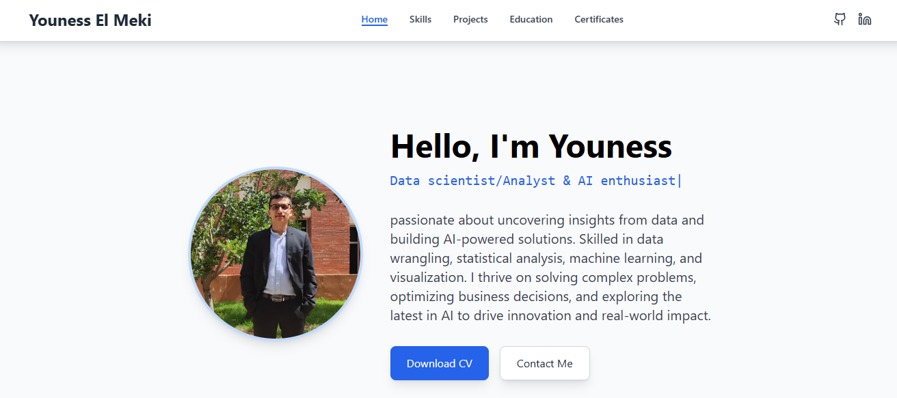

# Personal Portfolio Website

A modern, responsive personal portfolio website built with React and TailwindCSS, featuring animated sections for skills, projects, education, and certificates.



## 🚀 Live Demo

Visit the live portfolio at [https://youness331.github.io/portfolio/](https://youness331.github.io/Portfolio/)


## 🛠️ Technologies Used

- **React**: Frontend library for building the user interface
- **TailwindCSS**: Utility-first CSS framework for styling
- **Lucide React**: Modern icon set
- **React Hooks**: For state management and side effects

## 📦 Project Structure

```
portfolio/
├── public/                  # Static files
│   ├── mypic.jpg            # Profile picture
│   ├── el meki youness_cv.pdf # Resume/CV
│   ├── certifacates/        # Certificate PDFs and previews
│   └── ...
├── src/
│   ├── App.js               # Main application component
│   ├── index.js             # Entry point
│   └── scripts/
│       ├── skills.js        # Skills data
│       ├── projects.js      # Projects data
│       ├── education.js     # Education data
│       └── certificates.js  # Certificates data
└── package.json             # Dependencies and scripts
```

## 🚀 Installation and Setup

1. **Clone the repository**

```bash
git clone https://github.com/Youness331/portfolio.git
cd portfolio
```

2. **Install dependencies**

```bash
npm install
```

3. **Run the development server**

```bash
npm start
```

4. **Open your browser**

The application will open automatically at [http://localhost:3000](http://localhost:3000)

## 📝 Customization

### Personal Information

Edit your personal information in `App.js`:

- Update your name in the navigation bar
- Change your profile picture at `public/mypic.jpg`
- Update your bio and typewriter text
- Update your resume/CV at `public/el meki youness_cv.pdf`
- Add your GitHub and LinkedIn URLs

### Projects, Skills, Education, and Certificates

Update the data files in the `src/scripts/` directory:

- `skills.js`: Add or modify your skills and technologies
- `projects.js`: Showcase your projects with descriptions and technologies
- `education.js`: Update your education history
- `certificates.js`: Add your certificates and achievements

### Styling

The project uses TailwindCSS for styling. You can customize:

- Colors by editing the color values in the components
- Layout by modifying the TailwindCSS classes
- Typography by changing the font sizes and families

## 📤 Deployment

This project is configured for GitHub Pages deployment:

1. **Build the project**

```bash
npm run build
```

2. **Deploy to GitHub Pages**

```bash
npm run deploy
```

## 📄 License

This project is open source and available under the [MIT License](LICENSE).

## 🤝 Contact

If you have any questions or want to connect:

- Email: elmekiyouness@gmail.com
- GitHub: [Youness331](https://github.com/Youness331)
- LinkedIn: [Youness El Meki](https://www.linkedin.com/in/youness-el-meki-60316a200/)

---

Made with ❤️ by Youness El Meki